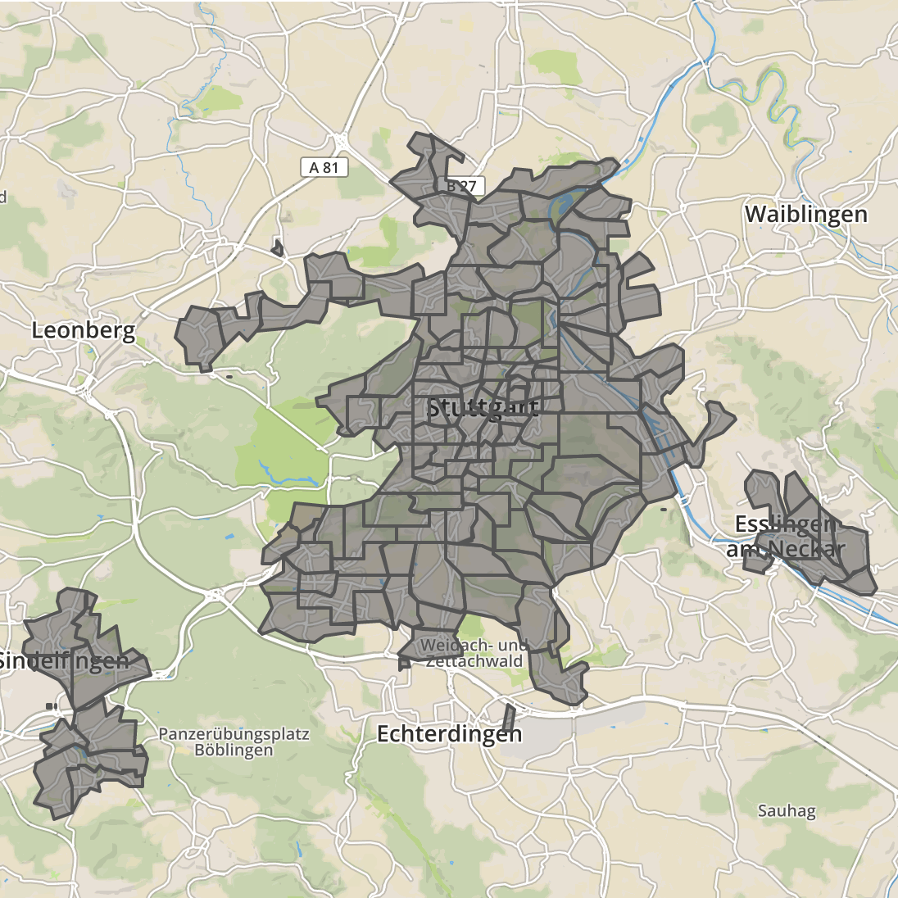

car2go radar
============

TL;DR
-----

```
$ npm install && npm run docker:compose:up
```

Description
-----------

`radar` calculates which cars are in which polygons. It uses:
- [Express](https://expressjs.com) as a web framework (`git show 2429fb4`)
- [`point-in-polygon`](https://www.npmjs.com/package/point-in-polygon) and [`polygon-lookup`](https://www.npmjs.com/package/polygon-lookup) as GeoJSON processing libraries (`git show aa38f82`)

Implementation notes
--------------------

Original test assignment says:

> Build a loop that regularly fetches the car2go vehicles for the location Stuttgart from our Open API:
> https://www.car2go.com/caba/customer/apidoc/index.html
> The vehicles are live data but are not streamed so you should refresh them in an interval.

I figured, querying an upstream API in a certain interval may lead to an idle traffic when there are no actual requests to this API.

So, I decided to go with caching responses (`git show ac37b2a`) instead of pulling data regularly. This approach has following advantages:
- data gets queried only when needed or when cache has expired
- response depends only on the data provided by an upstream API, hence, all post-processing results can be a part of cache (i.e., no need to recalculate response since it will be always the same until the original API response changes)

Some numbers:

```
# Response time of the original API (in seconds):
$ curl --silent --write-out "%{time_total}\n" --output /dev/null --header "Accept: application/json" https://www.car2go.com/caba/customer/v2/vehicles/stuttgart
0.432970
```

```
# Response time of the first request to `radar` (which is basically equals
# response time of the `caba`):
$ curl --silent --write-out "%{time_total}\n" --output /dev/null http://localhost:3000/cars
0.506468
```

```
# Second and all the consequent requests to `radar` within the next minute
# (default caching interval):
$ curl --silent --write-out "%{time_total}\n" --output /dev/null http://localhost:3000/cars
0.011694
```

[`cluster`](https://nodejs.org/api/cluster.html) was intentionally omitted in this implementation because it's a subject for discussion with operations in case of containerized environment.

Further improvements
--------------------

Amazing thing about programming is that things can be done in several ways, so there's always a space for improvements :)

From this point I think I'd go in the following directions:
- add endpoints for querying individual cars and polygons
- describe requests and responses using JSON Schema
- increase test coverage
- make request retry more intelligent based on timings and HTTP status codes
- collect some key metrics with statsd for further visualization by Grafana

---


